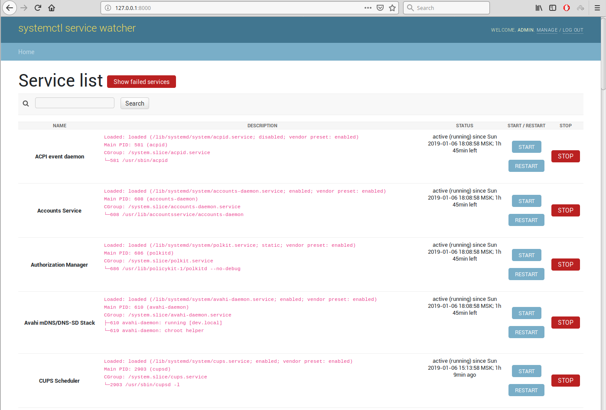
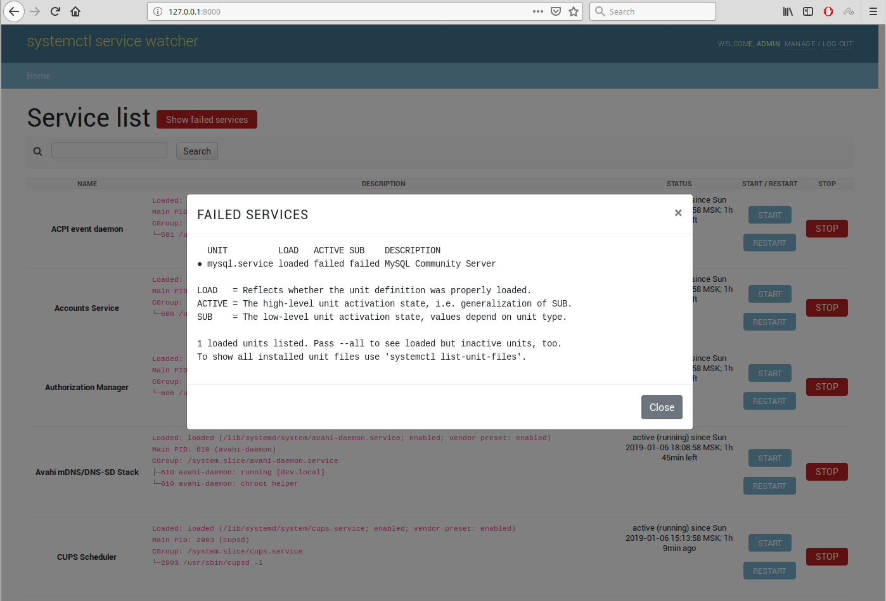

# systemd service watcher
**`systemd`** is a suite of basic building blocks for a Linux system. 
It provides a system and service manager that runs as `PID 1` and starts the rest of the system. 

**`systemd`** provides aggressive parallelization capabilities, uses socket and **_D-Bus_** activation for starting 
services, offers on-demand starting of daemons, keeps track of processes using Linux control groups, maintains mount and 
automount points, and implements an elaborate transactional dependency-based service control logic. 

**`systemd`** supports _**SysV**_ and _**LSB**_ init scripts and works as a replacement for sysvinit. Other parts 
include a logging daemon, utilities to control basic system configuration like the hostname, date, locale, maintain a 
list of logged-in users and running containers and virtual machines, system accounts, runtime directories and settings, 
and daemons to manage simple network configuration, network time synchronization, log forwarding, and name resolution.

## Screens
##### Example #1: Main page

##### Example #2: Failed services

