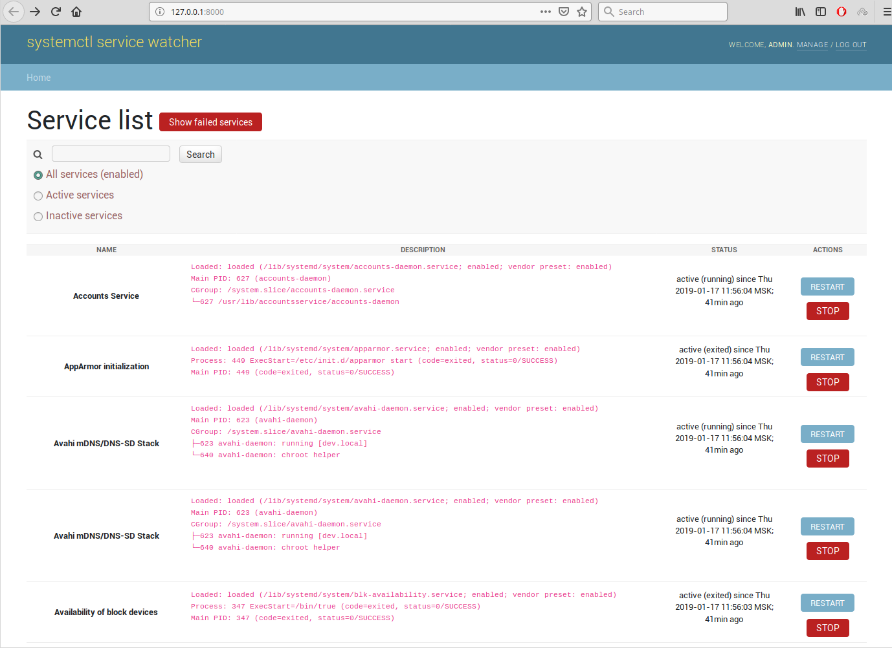
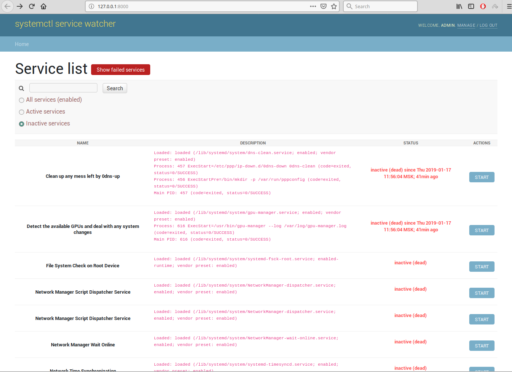
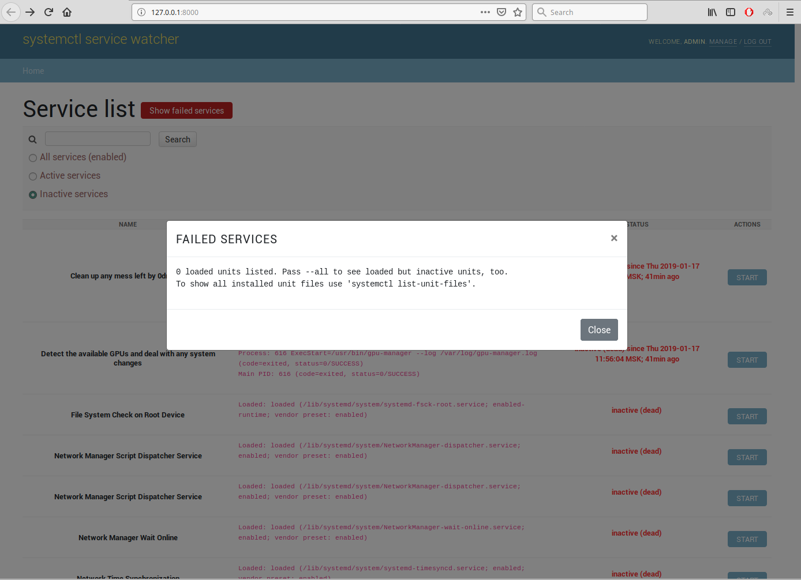
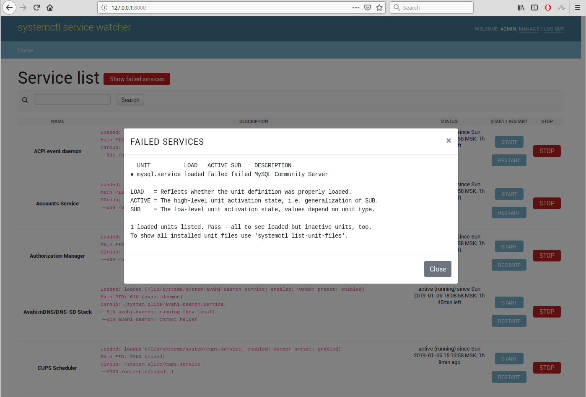

# systemd service watcher

**`systemd`** is a suite of basic building blocks for a Linux system.
It provides a system and service manager that runs as `PID 1` and starts the rest of the system.

**`systemd`** provides aggressive parallelization capabilities, uses socket and **_D-Bus_** activation for starting
services, offers on-demand starting of daemons, keeps track of processes using Linux control groups, maintains mount and
automount points, and implements an elaborate transactional dependency-based service control logic.

**`systemd`** supports _**SysV**_ and _**LSB**_ init scripts and works as a replacement for sysvinit. Other parts
include a logging daemon, utilities to control basic system configuration like the hostname, date, locale, maintain a
list of logged-in users and running containers and virtual machines, system accounts, runtime directories and settings,
and daemons to manage simple network configuration, network time synchronization, log forwarding, and name resolution.

## Config

Config examples here [.env.default](.env.default).

## How to run

Fill your database and run Django development server:

```shell
sudo apt-get install libdbus-glib-1-dev libdbus-1-dev
pip3 install -r requirements.txt
python manage.py makemigrations
python manage.py migrate
python manage.py collectstatic
```

To run with a docker compose:

```shell
docker-compose up
```

To run as `systemctl` unit:

* Move [systemd_watcher.service](systemd_watcher.service) file to `systemctl` service files
  directory (`/etc/systemd/system/`)
* Run this commands:

```shell
sudo systemctl enable systemd_watcher.service
sudo systemctl daemon-reload
sudo systemctl start systemd_watcher.service
```

## The note

Due to the `simplicity` of authorization and authentication, use this service only at `stages` and `preprod`. If you
still use it on `production`, then you need to deny access to the service **outside**, only for local use
on `production`.

## Screens

##### Example #1: Main page



##### Example #2: Inactive services



##### Example #3: Failed services



##### Example #4: Failed services


